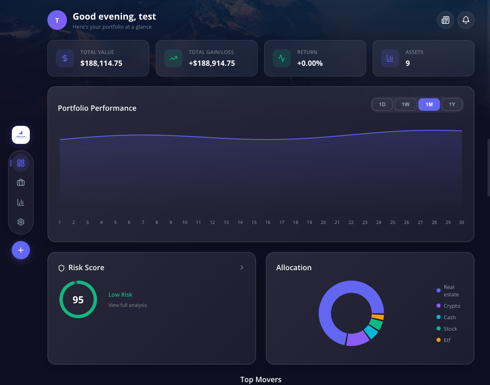
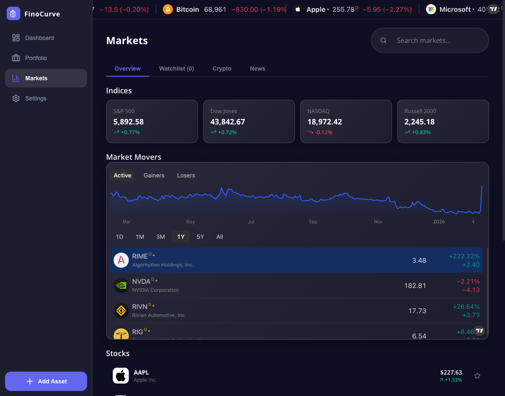
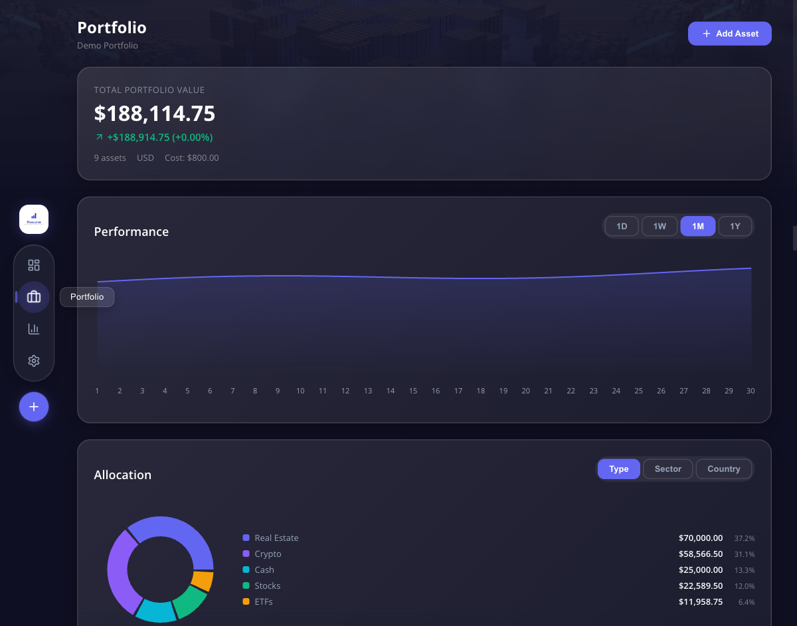
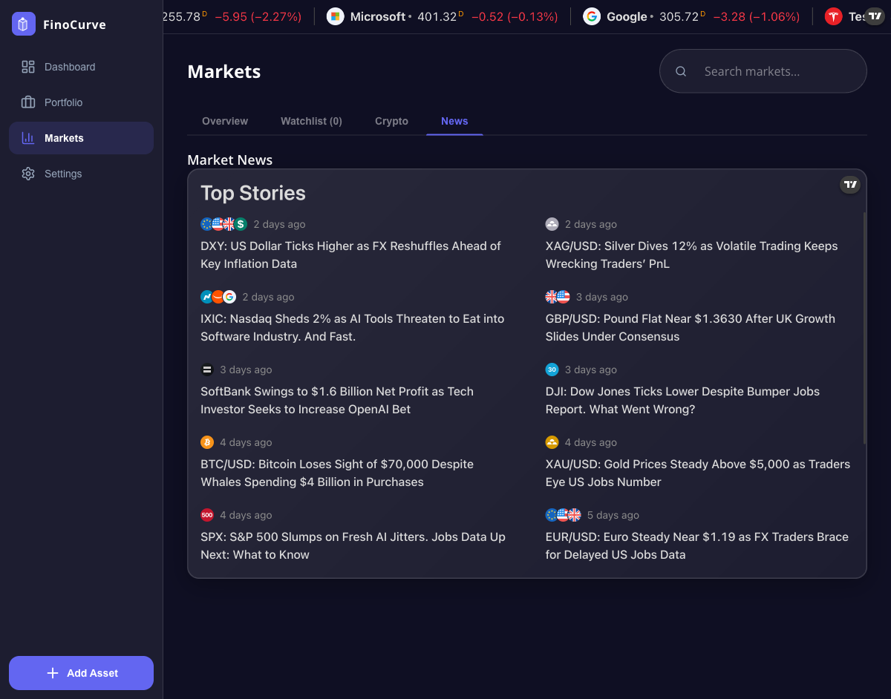

# <p align="center"></p>

# FinoCurve - Modern Investment Banking

FinoCurve is a sophisticated desktop application designed for modern investment banking and personal finance management. Built with performance and user experience in mind, it provides a comprehensive suite of tools for tracking assets, analyzing markets, and managing portfolios.

## 🚀 Key Features

- **Intuitive Dashboard**: A bird's-eye view of your financial health, including asset distribution and performance metrics.
- **Advanced Market Analysis**: Real-time market data with integrated TradingView charts for professional-grade technical analysis.
- **Portfolio Management**: Detailed tracking of your investments, including performance history and asset allocation.
- **Risk Analysis**: In-depth tools to evaluate portfolio risk and make informed investment decisions.
- **Asset & Loan Tracking**: Manage both your assets and liabilities (loans) in one unified interface.
- **News & Notifications**: Stay informed with the latest financial news and personalized alerts.
- **AI Assistant**: Local AI-powered document insights and chat (Ollama). Analyze documents for risk reports and chat via a global floating bubble.
- **Global Settings**: Customize your experience with currency preferences and account management.

## 🛠️ Tech Stack

- **Frontend**: [React 19](https://react.dev/)
- **Desktop Framework**: [Electron 34](https://www.electronjs.org/)
- **Build Tool**: [Vite 6](https://vitejs.dev/)
- **Language**: [TypeScript](https://www.typescriptlang.org/)
- **Data Visualization**: [Recharts](https://recharts.org/)
- **Icons**: [Lucide React](https://lucide.dev/)

## 📦 Installation & Setup

To get started with FinoCurve locally, follow these steps:

### Prerequisites

- [Node.js](https://nodejs.org/) (Latest LTS recommended)
- [npm](https://www.npmjs.com/)
- **AI features** (optional): [Ollama](https://ollama.ai) with a model (e.g. `ollama pull llama3.2`)

### Installation

1. Clone the repository:
   ```bash
   git clone https://github.com/your-username/finocurve-app.git
   cd finocurve-app
   ```

2. Install dependencies:
   ```bash
   npm install
   ```

### Development

Run the application in development mode:
```bash
npm run dev
```

### AI Assistant (Optional)

The AI assistant provides document analysis and chat. To use it:

1. Install [Ollama](https://ollama.ai) and run `ollama pull llama3.2` (or another model).
2. In Reports & Documents, upload PDFs or text files, then click **Analyze with AI**.
3. Use the floating chat bubble (bottom-right) to ask questions about your portfolio.
4. AI insights are included in generated risk reports when available.

**A2A protocol**: Set `AI_ENABLE_A2A=true` to expose the AI on `http://127.0.0.1:3847` for external agent access.

### Building for Production

To build the application for distribution:
```bash
npm run build
```

## 📸 Screenshots

| Dashboard | Market Analysis |
|-----------|-----------------|
|  |  |

| Portfolio | Risk Analysis |
|-----------|---------------|
|  |  |

---
*FinoCurve - Empowering your financial journey.*
